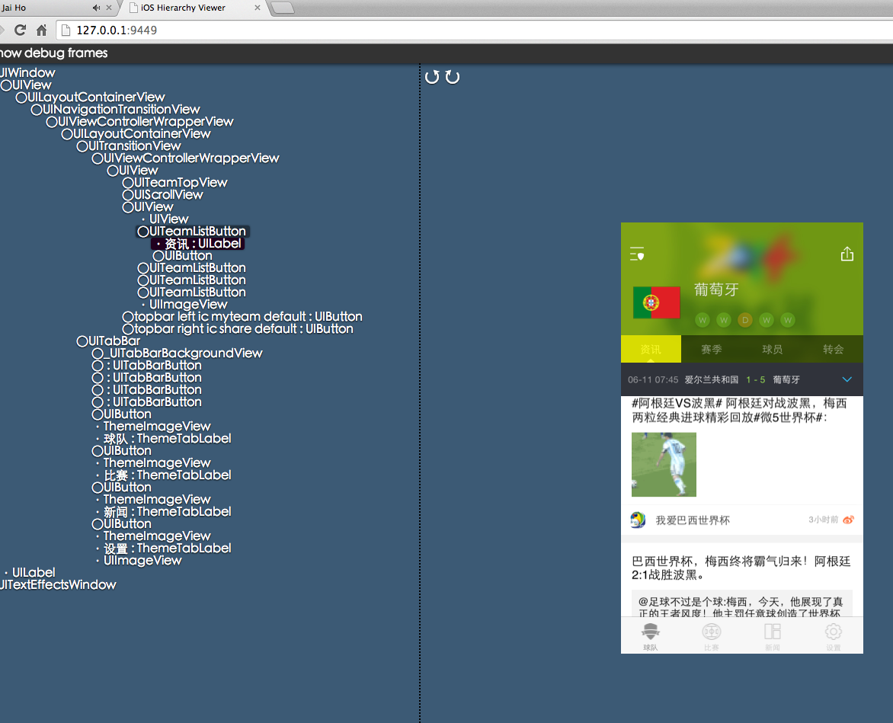

iOS-HierarchyViewer
===================

iOS Hierarchy Viewer  ---->优化于开源项目  

###useage
```
//===>模拟器：pc端调试    真机：真机safari 调式(后者需重设计)
+(void)start_viewerHierarchy{
    
#ifdef DEBUG
    [iOSHierarchyViewer start];
#endif
    
}

```

